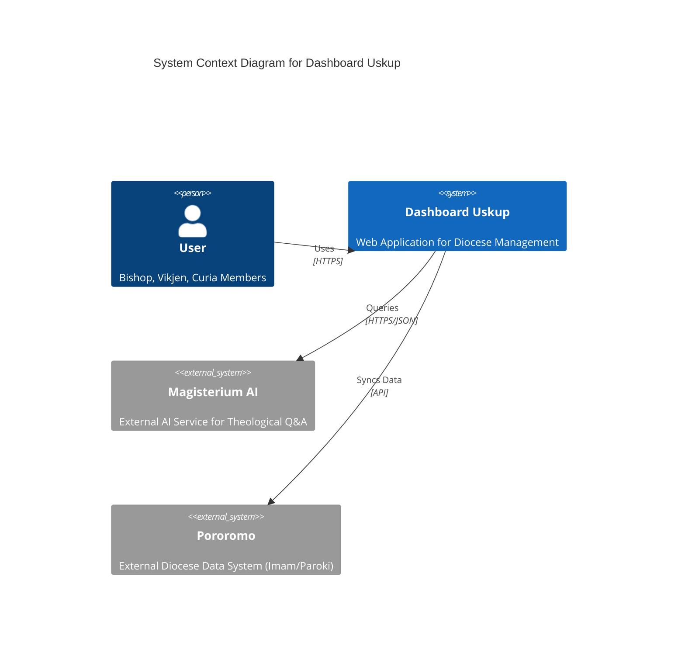
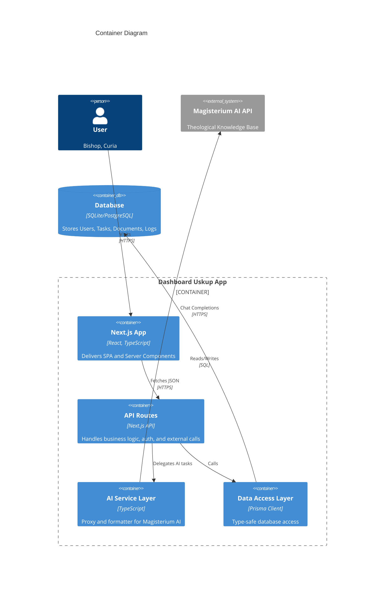
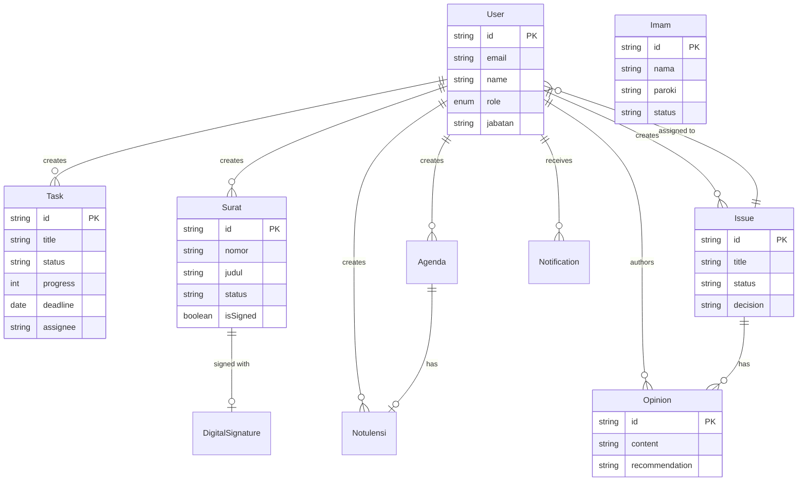

# System Architecture

## Overview

Dashboard Uskup is a modern web application built with **Next.js 14 (App Router)**, designed to assist the Bishop and Curia in managing diocese operations. It integrates **Artificial Intelligence (Magisterium AI)** to provide theological assistance and features a robust **Task Management**, **Document Management**, and **Collaboration** system.

## Tech Stack

- **Frontend/Backend**: Next.js 14, React, TypeScript, Tailwind CSS
- **Database**: SQLite (Development/Local), PostgreSQL (Production ready via Prisma)
- **ORM**: Prisma
- **AI Integration**: Magisterium AI API
- **Real-time**: Socket.IO (planned/partial integration through `useSocket`)
- **Authentication**: Custom JWT / NextAuth (hybrid)

## System Architecture Diagrams

### 1. System Context Diagram

High-level view of how users interact with the system.

### 2. Container Diagram

Detailed structural view of the application containers.

## Data Model (ERD)

The application uses a relational schema managed by Prisma. Below is the Entity Relationship Diagram.

## Core Modules

### 1. AI Assistant (`src/app/api/ai/chat`)

- **Purpose**: Provides theological answers with citations.
- **Flow**: User Message -> API Route -> `sendMagisteriumChat` -> Magisterium AI -> Format Response (Markdown + Citations) -> User.
- **Security**: API Key is stored server-side (`MAGISTERIUM_API_KEY`).

### 2. Task Management (`src/app/tasks`)

- **Purpose**: Track assignments for Bishop and Curia.
- **Features**: CRUD, Progress Tracking, Categorization.
- **Validation**: Server-side validation (Zod-like manual checks implemented in API).

### 3. Smart Reporting (Planned)

- Aggregate data from `Surat`, `Agenda`, and `Task` to generate monthly/yearly reports for the Bishop.

## Security Overview

- **Authentication**: JWT-based session management.
- **Role-Based Access Control (RBAC)**: Users have roles (`USKUP`, `VIKJEN`, `STAFF`) determining access (schema supported, middleware implementation pending).
- **Environment Variables**: Sensitive keys (`DATABASE_URL`, `MAGISTERIUM_API_KEY`) are kept in `.env`.
